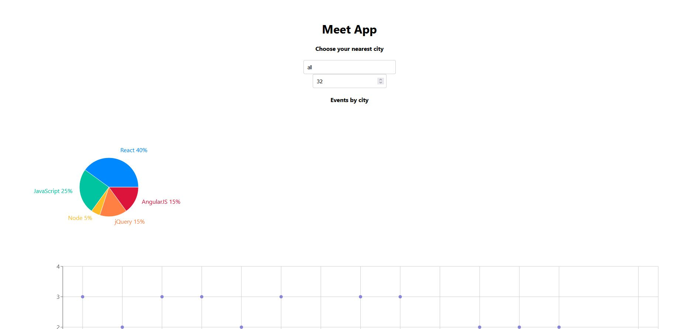
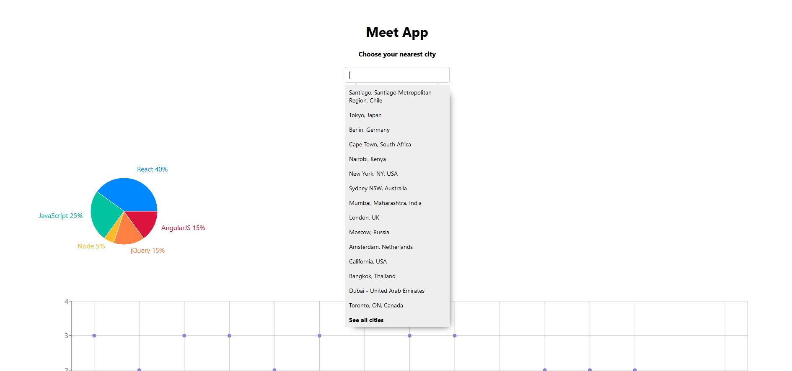
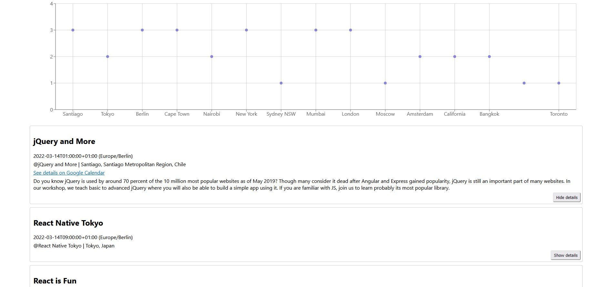

# Meet App. Technical Case Study

## Objective 
To build a serverless, progressive web application (PWA) with React using a test-driven development (TDD) technique. The application uses the Google Calendar API to fetch upcoming events.

## Context
Serverless and PWAs have grown in popularity over the last few years, and both are considered the future of web development. By combining these two concepts, this app will not only work as a standard web application, but it will also reap the benefits of both serverless architecture and PWAs:
- Serverless: No backend maintenance, easy to scale, always available, no cost for idle time
- PWAs: Instant loading, offline support, push notifications, "add to home screen" prompt, responsive design, and cross-platform compatibility.

## Project Deliverables Acknowledgement
- CareerFoundry (25.02.2021 - 17.03.2022)

## Project Improvement Strategies
- Nick Balan (18.03.2022 - Current)

## My Role
- Full-Stack Web Developer

## The 5 W's
- Who? — The users of your Meet application. They could be my friends, my professional network, or my potential employers
- What? — A progressive web app with the ability to work offline and a serverless backend developed using a TDD technique
- When? — Users of this app will be able to use it whenever they want to view upcoming events for a specific city. My recruiter will be able to see your code immediately on GitHub
- Where? — The server, in this case, is a serverless function hosted by a cloud provider (e.g., AWS). The application itself is also hosted online to make it shareable and installable. It can
be used even when the user is offline. As it's responsive, it displays well on any device
- Why? — Serverless is the next generation of cloud infrastructure, PWA provides excellent user experience and performance, and the TDD technique ensures I've built quality code with adequate test coverage.

## User Stories 
- As a user, I should be able to filter events by city so that I can see the list of events that take place in that city 
- As a user, I should be able to show/hide event details so that I can see more/less information about an event
- As a user, I should be able to specify the number of events I want to view in the app so that I can see more or fewer events in the events list at once
- As a user, I should be able to use the app when offline so that I can see the events I viewed the last time I was online
- As a user, I should be able to add the app shortcut to my home screen so that I can open the app faster
- As a user, I should be able to see a chart showing the upcoming events in each city to know what events are organized in which city.

## Technical Requirements & Solutions
- The app must be a React application
- The app must be built using the TDD technique
- The app must use the Google Calendar API and OAuth2 authentication flow
- The app must use serverless functions (AWS lambda is preferred) for the authorization server instead of using a traditional server
- The app's code must be hosted in a Git repository on GitHub 
The app must work on the latest versions of Chrome, Firefox, Safari, Edge, Opera, and IE11 
- The app must display well on all screen sizes (including mobile and tablet) with widths of 1920px and 320px
- The app must pass Lighthouse's PWA checklist 
- The app must work offline or in slow network conditions with the help of a service worker 
- Users may be able to install the app on desktop and add the app to their home screen on mobile
- The app must be deployed on GitHub Pages
- The API call must use React Axios, and async/await
- The app must implement an alert system using an OOP approach to show information to the user
- The app must make use of data visualization (recharts preferred)
- Tests must cover the app with a coverage rate >= 90%
- The app must be monitored using an online monitoring tool.

## Key Features
- Filter events by city 
- Show/hide event details 
- Specify the number of events 
- Use the app when offline 
- Add an app shortcut to the home screen 
- View a chart showing the number of upcoming events by city.

## Meet App screenshots

